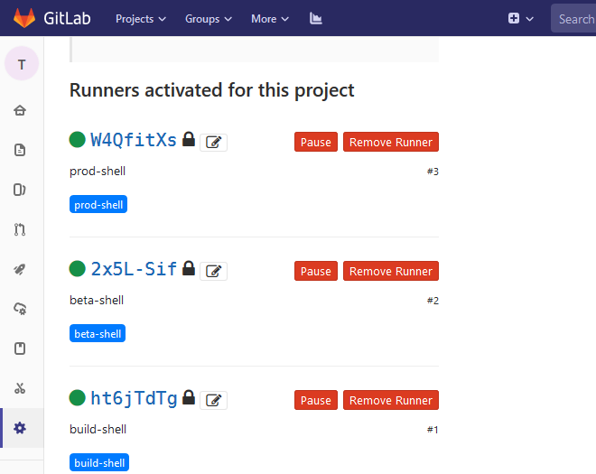

## 安装 Gitlab Runner

Gitlab Runner 安装方式有很多，可以参考官网文档 https://docs.gitlab.com/runner/install/; 这里为了方便直接在 Ubuntu1604 上 apt方式安装了。

``` bash
$ curl -L https://packages.gitlab.com/install/repositories/runner/gitlab-runner/script.deb.sh | sudo bash
$ apt-get install gitlab-runner
```

安装完成后就可以看到服务运行状态：`systemctl status gitlab-runner`，因为示例的java spring boot 项目需要，该虚机上要同时安装和配置 mvn 和 docker 环境。

注意：需要通过 gitlab-runner shell 执行docker镜像打包等命令，因此要修改下 gitlab-runner 服务运行用户："--user" "gitlab-runner" 改成 "--user" "root"

``` bash
vi /etc/systemd/system/gitlab-runner.service
[Unit]
Description=GitLab Runner
After=syslog.target network.target
ConditionFileIsExecutable=/usr/lib/gitlab-runner/gitlab-runner

[Service]
StartLimitInterval=5
StartLimitBurst=10
ExecStart=/usr/lib/gitlab-runner/gitlab-runner "run" "--working-directory" "/home/gitlab-runner" "--config" "/etc/gitlab-runner/config.toml" "--service" "gitlab-runner" "--syslog" "--user" "gitlab-runner"

Restart=always
RestartSec=120

[Install]
WantedBy=multi-user.target
```

以上配置改完保存后执行服务重启：

``` bash
$ systemctl daemon-reload
$ systemctl restart gitlab-runner
```

### 注册 Runner

运行命令`gitlab-runner register`后进入交互式界面，按照提示注册，关注下面注释内容。

``` bash
$ gitlab-runner register
Runtime platform                                    arch=amd64 os=linux pid=3269 revision=8bb608ff version=11.7.0
Running in system-mode.                            
                                                   
Please enter the gitlab-ci coordinator URL (e.g. https://gitlab.com/):
http://gitlab.test.com/       ### 这里输入gitlab URL
Please enter the gitlab-ci token for this runner:
tzfBWCX-tQxxo1TCcoeJ          ### 这里输入项目的token
Please enter the gitlab-ci description for this runner:
[k8s403]: build-shell         ### 命名此runner
Please enter the gitlab-ci tags for this runner (comma separated):
build-shell                   ### 重要：指定runner tag，在gitlab-ci.yml文件中定义该tag才能执行 mvn编译/docker打包的任务
Registering runner... succeeded                     runner=tzfBWCX-
Please enter the executor: docker-ssh, parallels, shell, ssh, virtualbox, kubernetes, docker, docker+machine, docker-ssh+machine:
shell                         ### 作为入门，在虚机上运行shell命令方式，方便调试
Runner registered successfully. Feel free to start it, but if it's running already the config should be automatically reloaded!
```
另外根据示例项目的ci/cd流程，还需要注册标签 tag 为 `beta-shell` 和 `prod-shell` 的两个 Runner; 注意这两个runner所在虚机需要分别配置测试k8s和生产k8s的 kubeconfig 配置，这样 Runner 才能通过 shell 脚本执行 kubectl apply 命令部署应用。三个 Runner 注册成功后可以看到如图：



