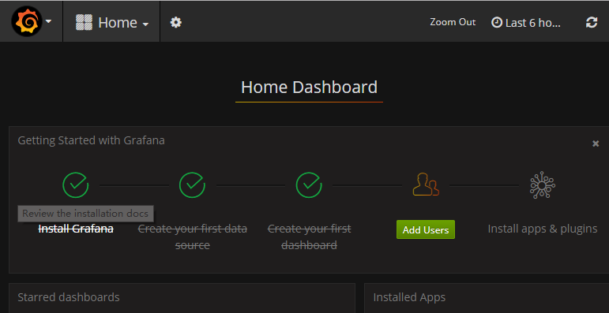
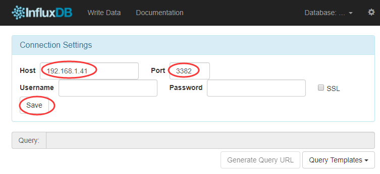

## heapster

`Heapster` 监控整个集群资源的过程：首先kubelet内置的cAdvisor收集本node节点的容器资源占用情况，然后heapster从kubelet提供的api采集节点和容器的资源占用，最后heapster 持久化数据存储到`influxdb`中（也可以是其他的存储后端,Google Cloud Monitoring等）。

`Grafana` 则通过配置数据源指向上述 `influxdb`，从而界面化显示监控信息。

### 部署

访问 [heapster release](https://github.com/kubernetes/heapster)页面下载最新 release 1.4.3，参考目录`heapster-1.3.0/deploy/kube-config/influxdb`，因为这个官方release 在k8s1.8.4使用还是有不少问题，请在参考的基础上使用本项目提供的yaml文件

1. [grafana](../../manifests/heapster/grafana.yaml)
1. [heapster](../../manifests/heapster/heapster.yaml)
1. [influxdb](../../manifests/heapster/influxdb.yaml)

安装比较简单 `kubectl create -f /etc/ansible/manifests/heapster/`，主要讲一下注意事项

#### grafana.yaml配置

+ 修改`heapster-grafana-amd64`镜像，v4.2.0版本修改成 v4.4.3版本，否则 grafana pod无法起来，报`CrashLoopBackOff`错误，详见[ISSUE](https://github.com/kubernetes/heapster/issues/1806)
+ 参数`- name: GF_SERVER_ROOT_URL`的设置要根据后续访问grafana的方式确定，如果使用 NodePort方式访问，必须设置成:`value: /`；如果使用apiserver proxy方式，必须设置成`value: /api/v1/namespaces/kube-system/services/monitoring-grafana/proxy/`，注意官方文件中预设的`value: /api/v1/proxy/namespaces/kube-system/services/monitoring-grafana/`已经不适合k8s 1.8.0版本了，
+ `kubernetes.io/cluster-service: 'true'` 和 `type: NodePort` 根据上述的访问方式设置，建议使用apiserver 方式，可以增加安全控制

#### heapster.yaml配置

+ 需要配置 RBAC 把 ServiceAccount `heapster` 与集群预定义的集群角色 `system:heapster` 绑定，这样heapster pod才有相应权限去访问 apiserver

#### influxdb.yaml配置

+ influxdb 官方建议使用命令行或 HTTP API 接口来查询数据库，从 v1.1.0 版本开始默认关闭 admin UI，这里参考[opsnull](https://github.com/opsnull/follow-me-install-kubernetes-cluster/blob/master/10-%E9%83%A8%E7%BD%B2Heapster%E6%8F%92%E4%BB%B6.md)给出的方法，增加ConfigMap配置，然后挂载到容器中，覆盖默认配置
+ 注意influxdb 这个版本只能使用 NodePort方式访问它的admin UI，才能正确连接数据库

### 验证

``` bash
$ kubectl get pods -n kube-system | grep -E 'heapster|monitoring'
heapster-3273315324-tmxbg               1/1       Running   0          11m
monitoring-grafana-2255110352-94lpn     1/1       Running   0          11m
monitoring-influxdb-884893134-3vb6n     1/1       Running   0          11m
```
扩展检查Pods日志：
``` bash
$ kubectl logs heapster-3273315324-tmxbg -n kube-system
$ kubectl logs monitoring-grafana-2255110352-94lpn -n kube-system
$ kubectl logs monitoring-influxdb-884893134-3vb6n -n kube-system
```
部署完heapster，使用上一步介绍方法查看kubernets dashboard 界面，就可以看到各 Nodes、Pods 的 CPU、内存、负载等利用率曲线图，如果 dashboard上还无法看到利用率图，使用以下命令重启 dashboard pod：
+ 首先删除 `kubectl scale deploy kubernetes-dashboard --replicas=0 -n kube-system`
+ 然后新建 `kubectl scale deploy kubernetes-dashboard --replicas=1 -n kube-system`

### 访问 grafana

#### 1.通过apiserver 访问（建议的方式）

``` bash
kubectl cluster-info | grep grafana
monitoring-grafana is running at https://x.x.x.x:6443/api/v1/namespaces/kube-system/services/monitoring-grafana/proxy
```
请参考上一步 [访问dashboard](dashboard.md)同样的方式，使用证书或者密码认证（参照hosts文件配置，默认：用户admin 密码test1234），访问`https://x.x.x.x:6443/api/v1/namespaces/kube-system/services/monitoring-grafana/proxy`即可，如图可以点击[Home]选择查看 `Cluster` `Pods`的监控图形



#### 2.通过NodePort 访问

+ 修改 `Service` 允许 type: NodePort
+ 修改 `Deployment`中参数`- name: GF_SERVER_ROOT_URL`为 `value: /`
+ 如果之前grafana已经运行，使用 `kubectl replace --force -f /etc/ansible/manifests/heapster/grafana.yaml` 重启 grafana插件

``` bash
kubectl get svc -n kube-system|grep grafana
monitoring-grafana        NodePort    10.68.135.50    <none>        80:5855/TCP		11m
```
然后用浏览器访问 http://NodeIP:5855 

### 访问 influxdb

官方建议使用命令行或 HTTP API 接口来查询`influxdb`数据库，如非必要就跳过此步骤

目前根据测试 k8s v1.8.4 使用 NodePort 方式访问 admin 界面后才能正常连接数据库

``` bash
kubectl get svc -n kube-system|grep influxdb
monitoring-influxdb    NodePort    10.68.195.193   <none>        8086:3382/TCP,8083:7651/TCP   12h
```
+ 如上例子，8083是管理页面端口，对外暴露的端口为7651
+ 8086 是数据连接端口，对外暴露的端口为3382

使用浏览器访问 http://NodeIP:7651，如图在页面的 “Connection Settings” 的 Host 中输入 node IP， Port 中输入 3382(由8086对外暴露的端口)，点击 “Save” 即可




