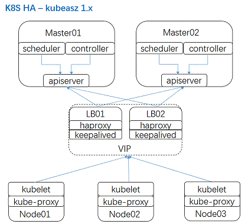
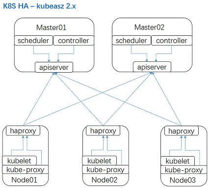

# 项目分支说明

为减小维护压力，避免产生混淆，精简项目分支为：`master`, `dev2`, `dev1`, `dev0`, `closed`; 分别对应发布版本如下：

- master 最新版本稳定分支（目前对应dev2）
- dev2 对应 kubeasz 2.x 版本的开发分支
- dev1 对应 kubeasz 1.x 版本的开发分支
- dev0 对应 kubeasz 0.x 版本的开发分支（已停止更新）
- closed 对应更老的版本分支（仅留档保存）

## 更新频率和内容 

- `master` 为最新稳定分支，更新相对频繁：**相关文档**，**功能特性**，BUG修复，组件更新
- `dev` 为开发测试分支，不一定稳定，更新频繁：**相关文档**，**功能特性**，BUG修复，组件更新
- `closed` 分支已停止更新：留档保存使用

## 安装架构变化

项目 0.x 1.x 与 2.x 版本的主要区别在于安装集群高可用架构不同；

- ha-1x 架构是之前k8s社区推荐的高可用方式，也是最早实践的稳定方案

- ha-2x 架构是更方便、兼容性（云上云下）更好，是目前项目推荐的方案

因基础架构差异，用户对于已有集群，**切勿更新 kubeasz 不同版本**（不能从0.x 升级 1.x，或者 1.x 升级 2.x）；可以根据当时安装集群时所用的 kubeasz 版本进行 k8s 版本的升级；比如：使用版本 kubeasz 1.2.0 安装了 k8s v1.11.5 集群，可以按照文档把 k8s 升级到 v1.13.6，但是建议不要去升级 kubeasz 版本，特别不能升级 kubeasz 1.2.0 至 kubeasz 2.0.0。
