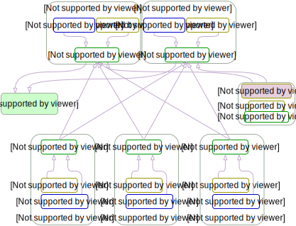

## 00-集群规划和基础参数设定

### HA architecture



- 注意1：确保各节点时区设置一致、时间同步。 如果你的环境没有提供NTP 时间同步，推荐集成安装[chrony](../guide/chrony.md)
- 注意2：确保在干净的系统上开始安装，不要使用曾经装过kubeadm或其他k8s发行版的环境
- 注意3：建议操作系统升级到新的稳定内核，请结合阅读[内核升级文档](../guide/kernel_upgrade.md)
- 注意4：在公有云上创建多主集群，请结合阅读[在公有云上部署 kubeasz](kubeasz_on_public_cloud.md)

## 高可用集群所需节点配置如下

|角色|数量|描述|
|:-|:-|:-|
|部署节点|1|运行ansible/ezctl命令，一般复用第一个master节点|
|etcd节点|3|注意etcd集群需要1,3,5,...奇数个节点，一般复用master节点|
|master节点|2|高可用集群至少2个master节点|
|node节点|n|运行应用负载的节点，可根据需要提升机器配置/增加节点数|

机器配置：
- master节点：4c/8g内存/50g硬盘
- worker节点：建议8c/32g内存/200g硬盘以上

注意：默认配置下容器运行时和kubelet会占用/var的磁盘空间，如果磁盘分区特殊，可以设置config.yml中的容器运行时和kubelet数据目录：`CONTAINERD_STORAGE_DIR` `DOCKER_STORAGE_DIR` `KUBELET_ROOT_DIR`

在 kubeasz 2x 版本，多节点高可用集群安装可以使用2种方式

- 1.按照本文步骤先规划准备，预先配置节点信息后，直接安装多节点高可用集群
- 2.先部署单节点集群 [AllinOne部署](quickStart.md)，然后通过 [节点添加](../op/op-index.md) 扩容成高可用集群

## 部署步骤

以下示例创建一个4节点的多主高可用集群，文档中命令默认都需要root权限运行。

### 1.基础系统配置

+ 2c/4g内存/40g硬盘（该配置仅测试用）
+ 最小化安装`Ubuntu 16.04 server`或者`CentOS 7 Minimal`
+ 配置基础网络、更新源、SSH登录等

### 2.在每个节点安装依赖工具

推荐使用ansible in docker 容器化方式运行，无需安装额外依赖。

### 3.准备ssh免密登陆

配置从部署节点能够ssh免密登陆所有节点，并且设置python软连接

``` bash
#$IP为所有节点地址包括自身，按照提示输入yes 和root密码
ssh-copy-id $IP 

# 为每个节点设置python软链接
ssh $IP ln -s /usr/bin/python3 /usr/bin/python
```

### 4.在部署节点编排k8s安装

- 4.1 下载项目源码、二进制及离线镜像

下载工具脚本ezdown，举例使用kubeasz版本3.5.0

``` bash
export release=3.5.0
wget https://github.com/easzlab/kubeasz/releases/download/${release}/ezdown
chmod +x ./ezdown
```

下载kubeasz代码、二进制、默认容器镜像（更多关于ezdown的参数，运行./ezdown 查看）

``` bash
# 国内环境
./ezdown -D
# 海外环境
#./ezdown -D -m standard
```

【可选】下载额外容器镜像（cilium,flannel,prometheus等）

``` bash
./ezdown -X
```

【可选】下载离线系统包 (适用于无法使用yum/apt仓库情形)

``` bash
./ezdown -P
```

上述脚本运行成功后，所有文件（kubeasz代码、二进制、离线镜像）均已整理好放入目录`/etc/kubeasz`

- 4.2 创建集群配置实例

``` bash
# 容器化运行kubeasz
./ezdown -S

# 创建新集群 k8s-01
docker exec -it kubeasz ezctl new k8s-01
2021-01-19 10:48:23 DEBUG generate custom cluster files in /etc/kubeasz/clusters/k8s-01
2021-01-19 10:48:23 DEBUG set version of common plugins
2021-01-19 10:48:23 DEBUG cluster k8s-01: files successfully created.
2021-01-19 10:48:23 INFO next steps 1: to config '/etc/kubeasz/clusters/k8s-01/hosts'
2021-01-19 10:48:23 INFO next steps 2: to config '/etc/kubeasz/clusters/k8s-01/config.yml'
```
然后根据提示配置'/etc/kubeasz/clusters/k8s-01/hosts' 和 '/etc/kubeasz/clusters/k8s-01/config.yml'：根据前面节点规划修改hosts 文件和其他集群层面的主要配置选项；其他集群组件等配置项可以在config.yml 文件中修改。

- 4.3 开始安装
如果你对集群安装流程不熟悉，请阅读项目首页 **安装步骤** 讲解后分步安装，并对 **每步都进行验证**  

``` bash
#建议使用alias命令，查看~/.bashrc 文件应该包含：alias dk='docker exec -it kubeasz'
source ~/.bashrc

# 一键安装，等价于执行docker exec -it kubeasz ezctl setup k8s-01 all
dk ezctl setup k8s-01 all

# 或者分步安装，具体使用 dk ezctl help setup 查看分步安装帮助信息
# dk ezctl setup k8s-01 01
# dk ezctl setup k8s-01 02
# dk ezctl setup k8s-01 03
# dk ezctl setup k8s-01 04
...
```

更多ezctl使用帮助，请参考[这里](ezctl.md)

[后一篇](01-CA_and_prerequisite.md)
